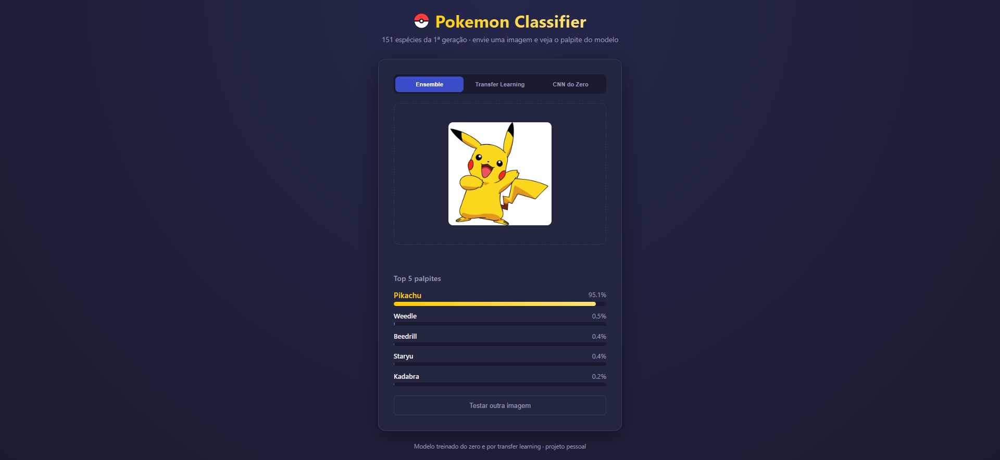
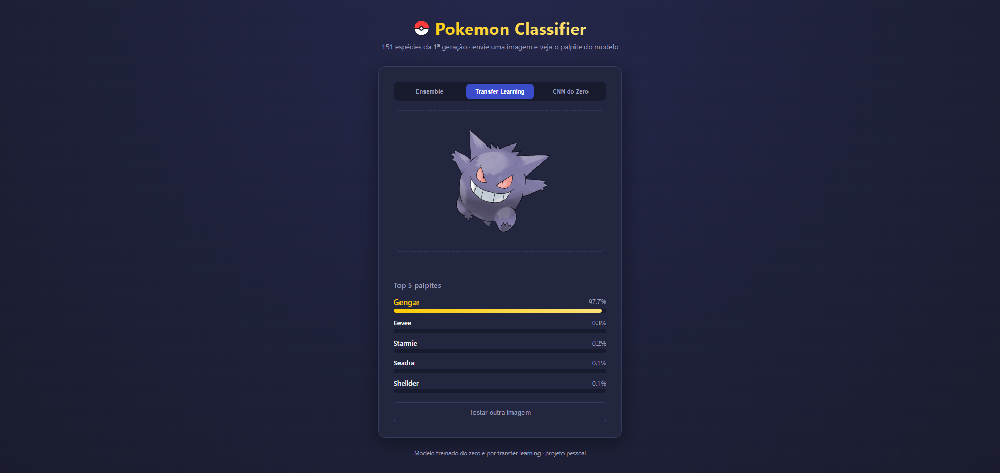
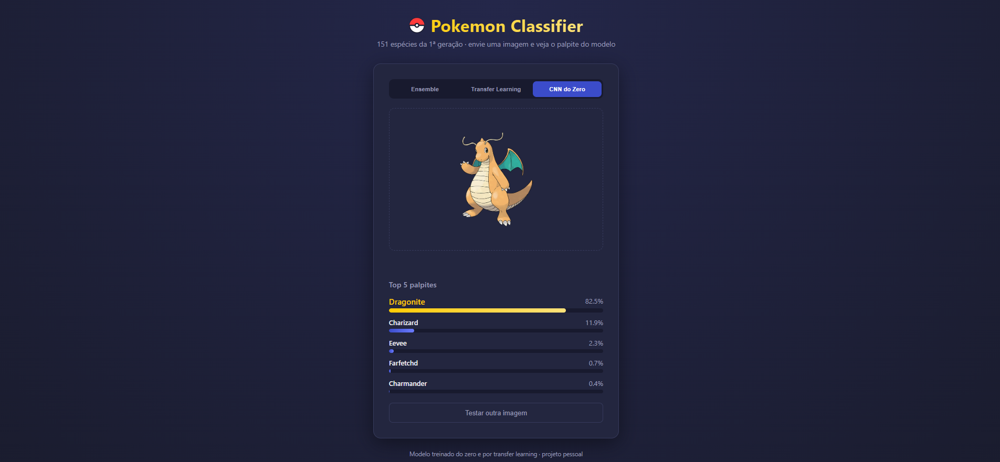
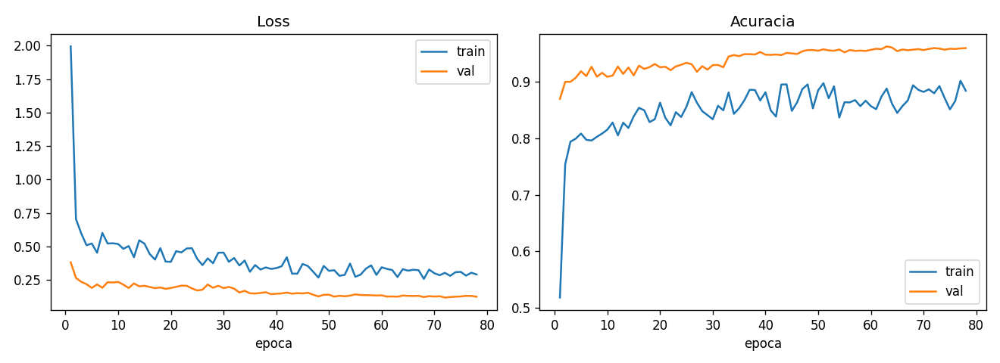
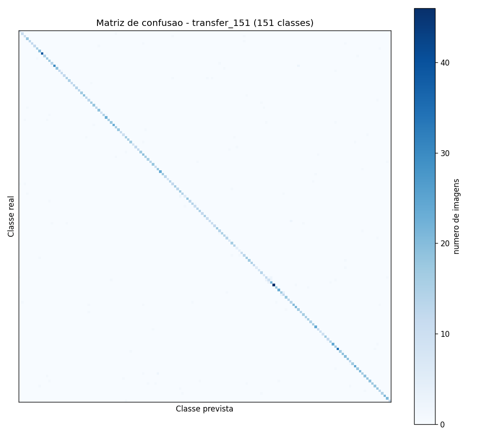

# Pokemon Classifier

Uma CNN treinada do zero e um modelo de transfer learning (ResNet18), competindo
para reconhecer as 151 espécies da primeira geração de Pokémon a partir de uma
imagem.

Projeto pessoal de aprendizado prático em visão computacional: curadoria de
dataset, arquitetura de rede neural, comparação de abordagens e avaliação
honesta dos resultados (incluindo um bug de vazamento de dados encontrado e
corrigido no meio do caminho).

<p align="center">
  
  
  
</p>

## Motivação

Ideia inspirada [neste vídeo](https://www.youtube.com/watch?v=IoM5zUI8oFc), sobre
alguém treinando uma IA do zero para jogar Super Mario. Comecei pequeno, com 4
espécies fáceis de distinguir só pela cor (Bulbasaur, Charmander, Pikachu,
Squirtle), para aprender o básico, e depois escalei para as 151 espécies
reais da primeira geração, onde o problema fica bem mais difícil (Charmander
e Charizard, por exemplo, são quase gêmeos de cor para um modelo simples).

## Resultados

Avaliados no conjunto de teste (2.478 imagens, sem sobreposição com treino/validação):

| Modelo | Acurácia | Top-5 |
|---|---|---|
| CNN do zero (residual + SE blocks, Focal Loss, Mixup/CutMix) | 82.8% | 94.6% |
| Transfer Learning (ResNet18, fine-tuning parcial do backbone) | 94.4% | 98.8% |
| **Ensemble (20% CNN do zero + 80% transfer learning)** | **94.7%** | n/d |

<p align="center">
  
  
</p>

Um exemplo real do comportamento diferente das duas abordagens: pedindo a
classificação de um Dragonite, a CNN do zero acerta (82.5%), mas coloca
Charizard como segunda opção (11.9%). Os dois são dragões alaranjados da
primeira geração. É um bom retrato da limitação conhecida de uma rede menor
sem conhecimento visual prévio: ela se apoia mais em cor do que forma, algo
que o transfer learning, por já ter aprendido conceitos visuais gerais no
ImageNet, praticamente não sofre.

### O bug que quase inflou os números

No meio do processo, o script de geração dos splits treino/val/teste não
limpava a pasta de saída antes de gerar de novo. Como o dataset cresceu várias
vezes ao longo do projeto, arquivos de execuções antigas ficaram acumulados.
Resultado: 1.617 imagens apareciam tanto em treino quanto em teste ao mesmo
tempo, inflando artificialmente a acurácia relatada (95.8% em vez dos 94.4%
reais). Encontrado, corrigido e todos os modelos reavaliados no conjunto de
teste limpo antes de fechar os números acima.

## O que foi testado

- **CNN do zero**: 4 blocos residuais com Squeeze-and-Excitation, Focal Loss
  ponderada por classe (ataca o desbalanceamento entre espécies), Mixup/CutMix,
  learning rate com `ReduceLROnPlateau`, early stopping dinâmico (para só
  quando o ganho vira marginal, não por teto fixo de épocas).
- **Transfer Learning**: ResNet18 pré-treinada no ImageNet, com fine-tuning
  parcial (último bloco residual descongelado, learning rate diferenciado
  entre backbone e cabeça nova).
- **Ensemble**: combinação ponderada das probabilidades dos dois modelos.
- **Test-Time Augmentation**: múltiplas variações aleatórias (crop, rotação,
  cor) por imagem de teste, com a predição final sendo a média.
- **Monte Carlo Dropout**: testado como alternativa ao TTA, mas não superou
  as outras técnicas (fica registrado como experimento honesto, nem tudo que
  se testa funciona).

## Estrutura do repositório

```
pokemon-classifier/
├── data_pipeline.py   # curadoria (corrompidos, bordas pretas, dedup) + geração de splits
├── models.py           # dataloaders, arquiteturas, losses, augmentation, loop de treino
├── train.py             # treino via CLI (--arch scratch|transfer)
├── app.py                # avaliação, ensemble, predição de imagem, servidor web
├── docs/images/           # gráficos de treino, matrizes de confusão e prints da interface
├── requirements.txt
└── README.md
```

## Como rodar

```bash
pip install -r requirements.txt

# treino (precisa de um dataset organizado em data/splits/{train,val,test}/<classe>/)
python train.py --arch transfer --splits-dir data/splits --results-dir results/transfer

# avaliação
python app.py evaluate --model transfer --splits-dir data/splits --tta-n 10

# classificar uma imagem via linha de comando
python app.py predict caminho/da/imagem.jpg --model transfer

# interface web (upload de imagem, escolha entre os 3 modelos)
python app.py serve
```

O dataset de imagens não está incluído neste repositório. Foi raspado de
várias fontes públicas, majoritariamente arte oficial e fan art de Pokémon,
e não é redistribuído aqui por questão de direitos autorais. O código em
`data_pipeline.py` documenta o processo de curadoria usado.

## Stack

Python, PyTorch, torchvision, Flask, scikit-learn, matplotlib, imagehash.
